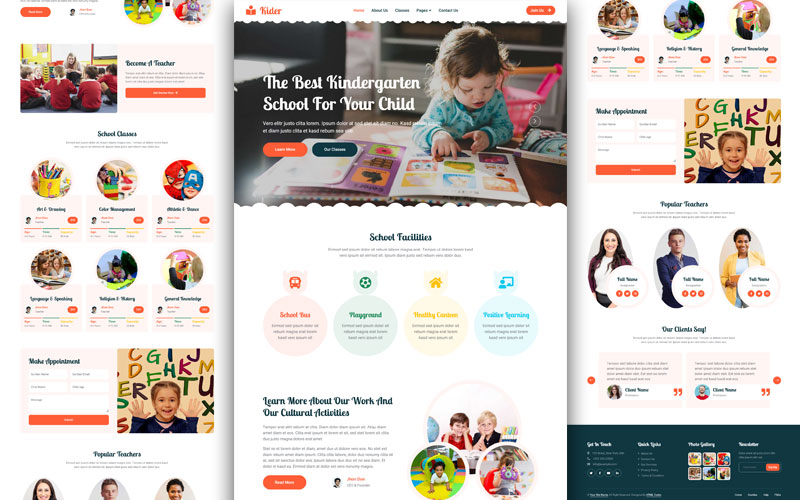

# Kider - Preschool Website
 Welcome to the Kider Preschool Website repository! This project is an online platform designed for a preschool, providing information about the school, programs, activities, and contact details.
  ()
 
 # Demo
Check out the live demo of the e-shopper Ecommerce Apparel Shop website: [Live Demo Link](https://hadiqaaziz.github.io/Kider---Preschool-Website/)
# Table of Contents
Pages
Installation
Usage
Technologies Used
Future Enhancements
Contributing
License

# Pages
- index.html: The main landing page providing an overview of the preschool.
- about.html: The about page detailing the preschool's mission, vision, and staff.
- classes.html: The classes page describing the different classes available.
- facility.html: The facility page showcasing the preschool's facilities.
- testimonials.html: The testimonials page featuring feedback from parents.
- contact.html: The contact page with a form for inquiries and contact information.
- team.html: The team page highlighting the preschool's staff.
- call-to-action.html: The call-to-action page for prospective teachers who wants to apply.
- appointment.html: The appointment page for scheduling visits or meetings.
# Installation
Clone the repository:
git clone https://github.com/yourusername/kider-preschool-website.git

Navigate to the project directory:
cd kider-preschool-website

# Technologies Used
- HTML
- CSS
- JavaScript
- Bootstrap
- 
# Future Enhancements
Add a gallery page to showcase photos and videos of the preschool
Implement a blog section for preschool updates and articles
Add a parent portal for accessing student-specific information
Enhance the contact form with validation and submission functionalities
Add an online enrollment form
Improve accessibility features across the site

# Contributing
Contributions are welcome!

# License
This project is licensed under the MIT License. See the LICENSE file for details.

Thank you for checking out the Kider Preschool Website repository! If you have any questions or suggestions, feel free to open an issue or reach out directly.
